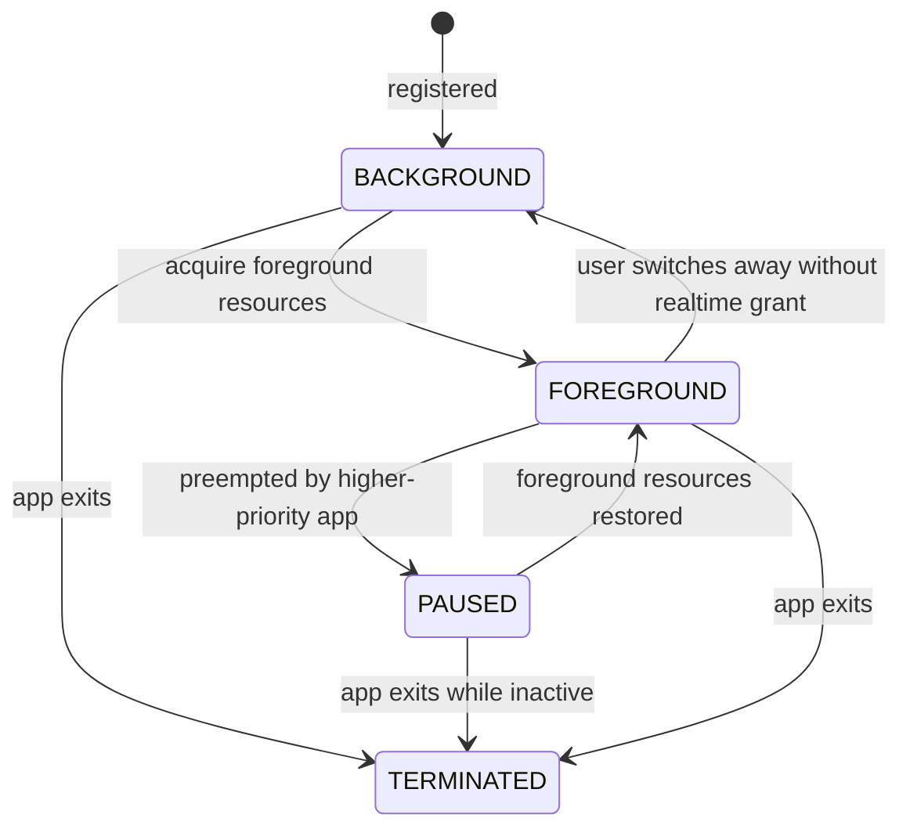

[README.md](https://github.com/user-attachments/files/28225304/README.md)
# RTOS Application Lifecycle & Resource Arbitration Project

This project is a small feature-phone runtime simulator written in Python.
It demonstrates a real RTOS-style problem:

- Version A reproduces the bug: a phone call UI becomes foreground, but the snake game still consumes timer ticks in the background.
- Version B fixes it at the system layer: an Application Manager owns lifecycle state transitions and resource arbitration, so non-foreground apps stop receiving real-time game ticks.

The fix is intentionally not implemented as `if (paused) return;` inside the snake game. The runtime decides which application receives screen, input, and timer/tick resources.

## Run

No third-party packages are required. Python 3.9+ is enough.

Run the bug reproduction:

```sh
python src/rtos_phone_sim.py --version A --scenario call_end
```

Run the fixed runtime:

```sh
python src/rtos_phone_sim.py --version B --scenario call_end
```

Run all required test scenarios:

```sh
python src/rtos_phone_sim.py --test
```

## Scenarios

- `normal`: game receives regular ticks and the snake moves.
- `call`: incoming call takes foreground resources. In Version A the game still advances; in Version B it does not.
- `call_end`: incoming call arrives, then ends. In Version B the snake resumes from the same position/direction/score it had when the call arrived.

## Version A: Bug Reproduction

Version A models the broken system:

1. Snake starts as the foreground app.
2. An incoming call event appears.
3. The call UI is drawn over the game and receives the screen.
4. The runtime does not revoke the game's timer/tick resource.
5. The game keeps advancing in the background and can collide with the wall.

The important observation is that UI coverage is not lifecycle management. The display changes, but the old application's real-time logic still runs.

## Version B: Fixed Runtime

Version B uses a system-level Application Manager:

1. The manager receives `EVENT_CALL_INCOMING`.
2. The call app becomes `FOREGROUND`.
3. The game transitions from `FOREGROUND` to `PAUSED`.
4. Resource ownership changes:
   - `screen`: call app
   - `input`: call app
   - `timer/tick`: call app or system only; snake receives no game tick
5. On `EVENT_CALL_END`, the call app terminates and the game returns to `FOREGROUND`.
6. Snake state is preserved and resumes from the previous position, direction, and score.

## Application Lifecycle



### States

- `FOREGROUND`: owns screen/input and may receive real-time ticks.
- `BACKGROUND`: alive but not visible; may handle low-priority events only.
- `PAUSED`: system-managed inactive state; no game tick is delivered.
- `TERMINATED`: removed from scheduling.

## Resource Arbitration

The simulator models three resources:

- `screen`
- `input`
- `timer/tick`

The `ApplicationManager` owns all assignments. Apps never directly steal resources from each other.

In Version B, when a call arrives, the manager applies a foreground preemption policy:

| Resource | Owner Before Call | Owner During Call | Owner After Call |
| --- | --- | --- | --- |
| screen | snake game | phone call | snake game |
| input | snake game | phone call | snake game |
| timer/tick | snake game | phone call/system | snake game |

This is the key difference from a plain UI overlay.

## Event Queue / Runtime Loop

The runtime loop processes these event types:

- `EVENT_TICK`
- `EVENT_INPUT`
- `EVENT_CALL_INCOMING`
- `EVENT_CALL_END`
- lifecycle transitions produced by the manager

Each simulation step:

1. Pop one event from the queue.
2. Let the Application Manager update lifecycle/resource ownership.
3. Dispatch the event only to eligible apps.
4. Render the current screen owner.
5. Append lifecycle/resource/tick decisions to the log.

## Core Module Interfaces

The code is intentionally contained in one C file for easy grading, but it is split by interface:

- `EventQueue`
  - `queue_push`
  - `queue_pop`
- `Application`
  - `on_lifecycle`
  - `on_event`
  - `render`
- `ApplicationManager`
  - `manager_init`
  - `manager_handle_system_event`
  - `manager_dispatch_tick`
  - `manager_set_foreground`
  - `manager_print_resource_table`
- `SnakeModel`
  - `snake_init`
  - `snake_tick`
  - `snake_render`

## Test Coverage

`--test` runs at least the three required scenarios:

1. Normal game running: confirms ticks advance snake position.
2. Incoming call: confirms phone UI gets foreground and, in Version B, snake ticks stop.
3. Call end: confirms phone exits and snake resumes from the saved state.

Version A is also printed for comparison, showing the background tick bug.

## Why Not Direct Task Suspend/Resume?

Directly suspending a task is a low-level mechanism, not a complete design. In a real RTOS, suspending an arbitrary task can leave locks held, resources unreleased, or state transitions half-applied. This project treats task suspension as an implementation detail below a clearer policy layer:

- lifecycle state describes intent;
- resource ownership describes authority;
- event dispatch decides who may run;
- app-specific logic stays unaware of phone-call special cases.

## Files

- `src/rtos_phone_sim.py`: runnable simulator.
- `README.md`: design, build instructions, lifecycle state diagram, resource arbitration, and tests.
